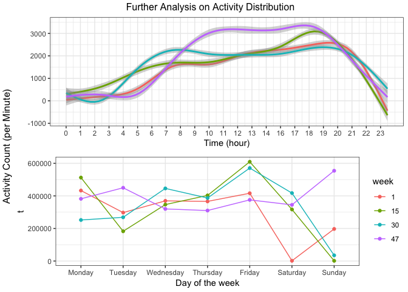

p8105\_mtp\_tt2714
================
Tiffany Tu
10/18/2018

``` r
data = read_csv(file = "data/p8105_mtp_data.csv") 
```

    ## Parsed with column specification:
    ## cols(
    ##   .default = col_double(),
    ##   week = col_integer(),
    ##   day = col_character()
    ## )

    ## See spec(...) for full column specifications.

``` r
clean_data = data %>% 
  gather(variable, value, -(week:day)) %>% 
  unite(temp, day) %>% 
  spread(temp, value) %>% 
  select(week, activity = variable, Monday, Tuesday, Wednesday, 
         Thursday, Friday, Saturday, Sunday) %>% 
  mutate(activity = str_replace(activity, "activity\\.", ""))
kable(head(clean_data))
```

<table>

<thead>

<tr>

<th style="text-align:right;">

week

</th>

<th style="text-align:left;">

activity

</th>

<th style="text-align:right;">

Monday

</th>

<th style="text-align:right;">

Tuesday

</th>

<th style="text-align:right;">

Wednesday

</th>

<th style="text-align:right;">

Thursday

</th>

<th style="text-align:right;">

Friday

</th>

<th style="text-align:right;">

Saturday

</th>

<th style="text-align:right;">

Sunday

</th>

</tr>

</thead>

<tbody>

<tr>

<td style="text-align:right;">

1

</td>

<td style="text-align:left;">

1

</td>

<td style="text-align:right;">

1

</td>

<td style="text-align:right;">

1

</td>

<td style="text-align:right;">

1

</td>

<td style="text-align:right;">

1

</td>

<td style="text-align:right;">

1

</td>

<td style="text-align:right;">

1

</td>

<td style="text-align:right;">

1

</td>

</tr>

<tr>

<td style="text-align:right;">

1

</td>

<td style="text-align:left;">

10

</td>

<td style="text-align:right;">

53

</td>

<td style="text-align:right;">

1

</td>

<td style="text-align:right;">

291

</td>

<td style="text-align:right;">

43

</td>

<td style="text-align:right;">

1

</td>

<td style="text-align:right;">

1

</td>

<td style="text-align:right;">

1

</td>

</tr>

<tr>

<td style="text-align:right;">

1

</td>

<td style="text-align:left;">

100

</td>

<td style="text-align:right;">

11

</td>

<td style="text-align:right;">

1

</td>

<td style="text-align:right;">

1

</td>

<td style="text-align:right;">

1

</td>

<td style="text-align:right;">

1

</td>

<td style="text-align:right;">

1

</td>

<td style="text-align:right;">

1

</td>

</tr>

<tr>

<td style="text-align:right;">

1

</td>

<td style="text-align:left;">

1000

</td>

<td style="text-align:right;">

349

</td>

<td style="text-align:right;">

163

</td>

<td style="text-align:right;">

561

</td>

<td style="text-align:right;">

11

</td>

<td style="text-align:right;">

127

</td>

<td style="text-align:right;">

1

</td>

<td style="text-align:right;">

305

</td>

</tr>

<tr>

<td style="text-align:right;">

1

</td>

<td style="text-align:left;">

1001

</td>

<td style="text-align:right;">

914

</td>

<td style="text-align:right;">

238

</td>

<td style="text-align:right;">

1035

</td>

<td style="text-align:right;">

408

</td>

<td style="text-align:right;">

364

</td>

<td style="text-align:right;">

1

</td>

<td style="text-align:right;">

276

</td>

</tr>

<tr>

<td style="text-align:right;">

1

</td>

<td style="text-align:left;">

1002

</td>

<td style="text-align:right;">

492

</td>

<td style="text-align:right;">

64

</td>

<td style="text-align:right;">

1596

</td>

<td style="text-align:right;">

238

</td>

<td style="text-align:right;">

561

</td>

<td style="text-align:right;">

1

</td>

<td style="text-align:right;">

425

</td>

</tr>

</tbody>

</table>

This dataset observes 47 weeks of recorded physical activity.

-----

1.  week vs activity and hour vs activity (mean)

<!-- end list -->

``` r
total_activity_day = clean_data %>% 
  group_by(week) %>% 
  select(-activity) %>% 
  summarise_all(funs(sum)) %>% 
  gather('Monday', 'Tuesday', 'Wednesday', 'Thursday', 'Friday', 'Saturday', 'Sunday', key = "day", value = "activity") %>% 
  mutate(day = forcats::fct_relevel(day, c('Monday', 'Tuesday', 'Wednesday', 'Thursday', 'Friday', 'Saturday', 'Sunday'))) 

activity_by_day = total_activity_day %>%
  group_by(day) %>% summarise_at(vars(activity), mean) %>% mutate(activity, activity = round(activity))

ggplot(activity_by_day, aes(x = day, y = activity, group = 1, color = "red")) + geom_point() + geom_line() + geom_text_repel(aes(label = activity), size = 2.8, color = "black") + theme_bw() + labs(title = "Average activity in a week", x = "Day of Week", y = "Activity (per Minute)") + theme(legend.position = "none")
```

<!-- -->
