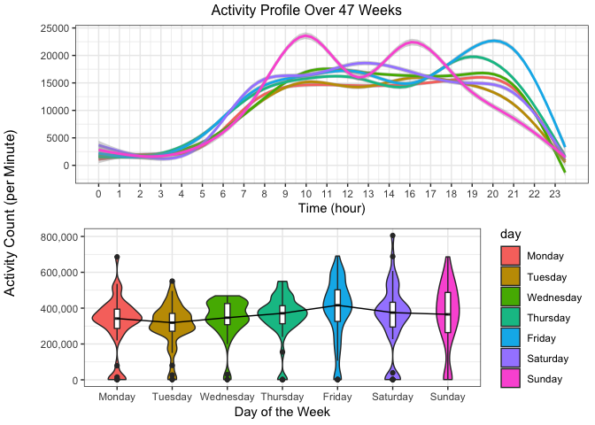
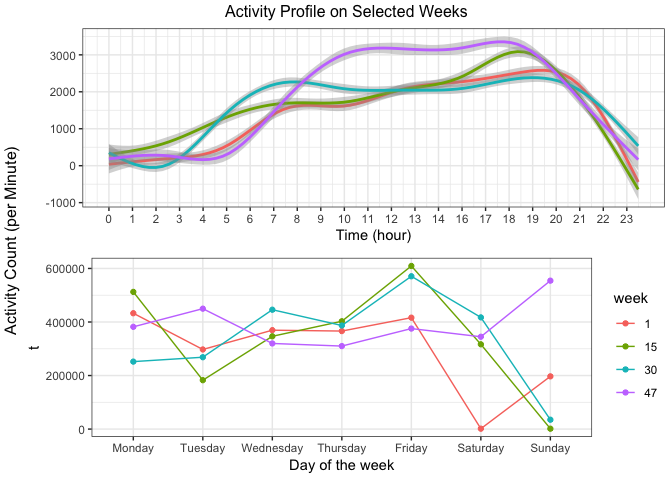

p8105\_mtp\_tt2714
================
Tiffany Tu
10/18/2018

### Initial data cleaning and exploring…

``` r
data = read_csv(file = "data/p8105_mtp_data.csv") 
clean_data = data %>% 
  gather(variable, value, -(week:day)) %>% 
  unite(temp, day) %>% rename(day = temp, time = variable, activity = value) %>% 
  mutate(time = str_replace(time, "activity\\.", "")) %>% 
  mutate(time = as.numeric(time), week = as.factor(week), 
         day = forcats::fct_relevel(day, c('Monday', 'Tuesday', 'Wednesday', 'Thursday', 'Friday', 'Saturday', 'Sunday'))) 
```

This dataset observes physical activity by minutes through a 24-hour
period for 47 weeks. After cleaning the dataset, we have 4 variables:
week, day, time, activity, for 473760 observations. We have activity
counts for each time point in minutes and we want to explore whether the
individual became more active over time. The average activity count for
the whole duration of the study is approximately 240. The maximum
activity count occured on a Sunday at hour 16.

### Activity distribution across time and week

``` r
activity_day = clean_data %>% 
  group_by(week, day) %>% select(-time) %>% 
  summarise_all(funs(sum)) 

dist_dayplot = ggplot(activity_day, aes(x = day, y = activity)) + 
  geom_violin(adjust = 0.8, aes(fill = day)) + 
  geom_boxplot(width = 0.1) + labs(x = "Day of the Week", y = "") + 
  theme_bw() + scale_y_continuous(labels = scales::comma) + 
  stat_summary(fun.y = median, geom = "line", aes(group = 1))
```

``` r
time_formatter <- function(x) {h <- floor(x/60)}
activity_time = clean_data %>% 
  group_by(time, day) %>% select(-week) %>%
  summarise_all(funs(sum)) 

dist_timeplot = ggplot(activity_time, aes(x = time, y = activity, color = day)) + 
  geom_smooth(method = "auto") + 
  scale_x_continuous(label = time_formatter, breaks = seq(1, 1440, by = 64)) + 
  labs(x = "Time (hour)", y = "") + theme_bw() + theme(legend.position = "none")
```

``` r
grid.arrange(dist_timeplot, dist_dayplot, top = "Activity Distribution Over 47 Weeks", 
             left = "Activity Count (per Minute)")
```

<!-- -->

Looking at activity distribution over time, we can confirm that the
maximum activity point occured most often on Sundays, particularly
between the hours 9 and 11. During the evening, this individual is least
active on Sundays and most active on Fridays. From the steady decrease
in activity counts between hour 21 to 23 and the increase between hour 4
to 8, we could possibily infer the individual’s resting period. For this
particular graph, I used `geom_smooth(method = "auto")` so that the
smoothing method is picked based on the size of the largest group.

The violin plot shows the probability density of activity counts on each
day of the week. Monday through Thursday we see fatter density widths,
meaning that there was a higher frequency for each activity point as
compared to fewer frequency with a greater spread, which we observe for
Friday through Sunday. The median is highest for Friday, but overall
closely
distributed.

### Weekly average activity count

``` r
ggplot(clean_data %>% group_by(week) %>% select(-time, -day) %>% summarise_all(funs(sum)),
       aes(x = week, y = activity, group = 1, color = "red")) + 
  geom_point() + geom_line() + scale_x_discrete(breaks = seq(1, 47, by = 4)) +
  scale_y_continuous(breaks = seq(0, 5000000, by = 500000)) + 
  labs(title = "Average Activity per week", x = "Week", y = "Activity Count (per Minute)") +
  theme_bw() + theme(legend.position = "none") + 
  geom_smooth(method = "lm", se = FALSE, color = "navyblue", size = 0.5, linetype = 2)
```

-1.png)<!-- -->

The average activity count is computed across 24 hours of each day for
each week. We do see drastic decrease during week 3 and week 12, but the
individual was able to get back on track and eventually improve his
activity count by week 47.

### Activity on selected weeks

Let’s take a look at week 1, 15, 30, and 47…

``` r
week_analysis = clean_data %>% 
  filter(week == 1 | week == 15 | week == 30 | week == 47) 

week_plot1 = ggplot(week_analysis %>% select(-time) %>% 
  group_by(day, week) %>% summarise_all(funs(sum)), 
  aes(x = day, y = activity, group = week, color = week)) + 
  geom_point() + geom_line() + theme_bw() + 
  labs(x = "Day of the week", y = "t") 
```

``` r
week_plot2 = ggplot(week_analysis %>% select(-day) %>% 
  group_by(time, week) %>% summarise_all(funs(sum)), 
  aes(x = time, y = activity, group = week, color = week)) + geom_smooth(method = "auto") + theme_bw() +
  labs(x = "Time (hour)", y = "") + 
  scale_x_continuous(label = time_formatter, breaks = seq(1, 1440, by = 64)) + theme(legend.position = "none")
```

``` r
grid.arrange(week_plot2, week_plot1, top = "Further Analysis on Activity Distribution", left = "Activity Count (per Minute)")
```

<!-- -->

We are not able to extract that much information from the simple average
activity count plot, so let’s take a look at 4 particular weeks.
Activity distribution over time shows a greater improvement for week 47
during the hours of 8 and 18. Other hours through the day seem much more
variable. While there is visiable improvement for week 47, the other 3
weeks does not seem to show much difference in distribution.

Activity distribution over days of the week show more activity in week
47 for Tuesday and Sundays. Week 15 and 30 also appear as the largest
activity count compared to other weeks for a given day. Week 1 remains
under the maximum average activity count for all days of the week.
